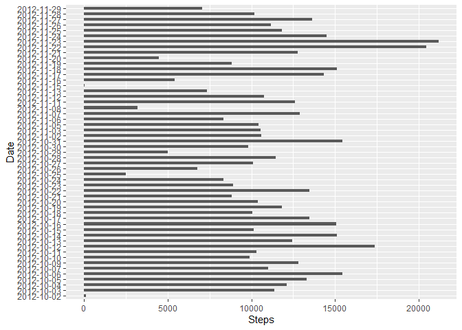
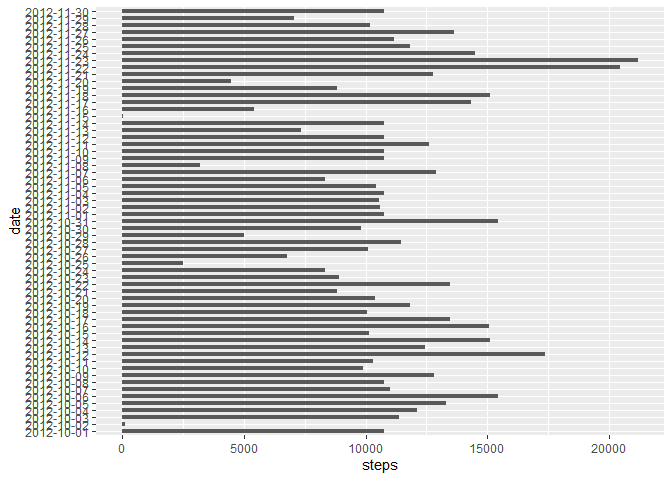
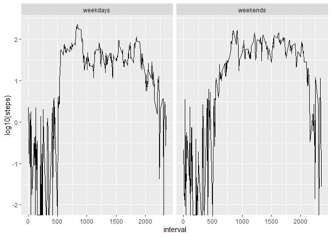

```r
knitr::opts_chunk$set(fig.path = "figures/")
```
## Loading and preprocessing the data

1. Load the data (i.e. \color{red}{\verb|read.csv()|}read.csv())

```r
activity<-read.csv(file="activity.csv",header=TRUE)
```

2.Process/transform the data (if necessary) into a format suitable for your analysis

```r
y<-complete.cases(activity)  ## REmoving the NA values
new_activity<-activity[y,]
```

##Histogram of the total number of steps taken each day
1.Histogram of the total number of steps taken each day

```r
x<-as.data.frame(tapply(new_activity$steps,new_activity$date,sum))
colnames(x)<-"Steps"
x[["Date"]]<-rownames(x)
y<-is.na(x$Steps)
x<-x[!y,]
rownames(x)<-1:53
library(ggplot2)
## Plot
ggplot(x,aes(Date,Steps))+geom_bar(stat="identity",width=0.5)+coord_flip()
```

<!-- -->

## What is mean total number of steps taken per day?

1.Mean and median number of steps taken each day
## Mean 


```r
x<-tapply(new_activity$steps,new_activity$date,sum)
mean(x,na.rm=TRUE)
```

```
## [1] 10766.19
```

## Median


```r
x<-tapply(new_activity$steps,new_activity$date,sum)
median(x,na.rm=TRUE)
```

```
## [1] 10765
```

## What is the average daily activity pattern?

1.Time series plot of the average number of steps taken


```r
library(lattice)
steps<-aggregate(steps~interval,new_activity,mean,na.rm=TRUE)
ggplot(steps,aes(interval,steps))+geom_line()
```

<!-- -->

2.The 5-minute interval that, on average, contains the maximum number of steps


```r
steps[which.max(steps$steps),1]
```

```
## [1] 835
```

## Imputing missing values

1.Calculate and report the total number of missing values in the dataset


```r
sum(!complete.cases(activity))
```

```
## [1] 2304
```

2.Code to describe and show a strategy for imputing missing data


```r
stepsAvg<-aggregate(steps~interval,activity,mean)
CompleteSteps<-numeric()
for(i in 1:nrow(activity)){
  obs<-activity[i,]
  if(is.na(obs$steps)){
    steps<-subset(stepsAvg,interval==obs$interval)$steps
  }
  else{
    steps<-obs$steps
  }
  CompleteSteps<-c(CompleteSteps,steps)
}
```

3.Create a new dataset that is equal to the original dataset but with the missing data filled in.


```r
activity_new<-activity
activity_new$steps<-CompleteSteps
```

4.Histogram of the total number of steps taken each day after missing values are imputed


```r
totalSteps<-aggregate(steps~date,activity_new,sum)
ggplot(totalSteps,aes(date,steps))+geom_bar(stat="identity",width=0.5)+coord_flip()
```

<!-- -->

## Are there differences in activity patterns between weekdays and weekends?

1.Create a new factor variable in the dataset with two levels – “weekday” and “weekend” indicating whether a given date is a weekday or weekend day.


```r
days<-activity_new$date
days<-as.POSIXct(days,"%Y-%m-%d")
```

```
## Warning in strptime(xx, f, tz = tz): unknown timezone '%Y-%m-%d'
```

```
## Warning in as.POSIXct.POSIXlt(x): unknown timezone '%Y-%m-%d'
```

```
## Warning in strptime(xx, f, tz = tz): unknown timezone '%Y-%m-%d'
```

```
## Warning in as.POSIXct.POSIXlt(x): unknown timezone '%Y-%m-%d'
```

```
## Warning in strptime(xx, f, tz = tz): unknown timezone '%Y-%m-%d'
```

```
## Warning in as.POSIXct.POSIXlt(x): unknown timezone '%Y-%m-%d'
```

```
## Warning in strptime(xx, f, tz = tz): unknown timezone '%Y-%m-%d'
```

```
## Warning in as.POSIXct.POSIXlt(x): unknown timezone '%Y-%m-%d'
```

```
## Warning in strptime(xx, f, tz = tz): unknown timezone '%Y-%m-%d'
```

```
## Warning in as.POSIXct.POSIXlt(x): unknown timezone '%Y-%m-%d'
```

```
## Warning in strptime(x, f, tz = tz): unknown timezone '%Y-%m-%d'
```

```
## Warning in as.POSIXct.POSIXlt(as.POSIXlt(x, tz, ...), tz, ...): unknown timezone
## '%Y-%m-%d'
```

```r
days<-weekdays(days)
```

```
## Warning in as.POSIXlt.POSIXct(x, tz): unknown timezone '%Y-%m-%d'
```

```r
dayNames<-c("Monday","Tuesday","Wednesday","Thursday","Friday")
for(i in 1:length(days)){
  if(days[[i]] %in% dayNames){
    days[[i]]<-"weekdays"
  }
  else{
    days[[i]]<-"weekends"
  }
}
activity_new$days<-days
head(activity_new,n=3)
```

```
##       steps       date interval     days
## 1 1.7169811 2012-10-01        0 weekdays
## 2 0.3396226 2012-10-01        5 weekdays
## 3 0.1320755 2012-10-01       10 weekdays
```

2.Panel plot comparing the average number of steps taken per 5-minute interval across weekdays and weekends


```r
stepsDays<-aggregate(steps~days+interval,activity_new,mean)
ggplot(stepsDays,aes(interval,log10(steps)))+geom_line()+facet_grid(.~days)
```

<!-- -->
